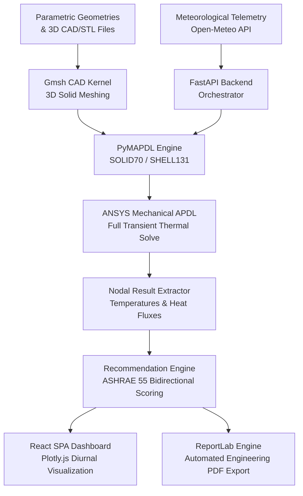

# 🏔️ Passive Thermal Shelter Analysis & Recommendation Platform

[](https://www.python.org/downloads/)
[](https://fastapi.tiangolo.com/)
[](https://react.dev/)
[](https://www.ansys.com/)
[](https://mapdl.docs.pyansys.com/)
[](LICENSE)

An enterprise-grade engineering decision support system for **passive solar thermal shelter simulation, transient FEA modeling, and optimal design recommendation**. Primarily developed for extreme high-altitude alpine regions (e.g., **Ladakh, Kargil, Spiti Valley, Indian Himalayas**) with universal support for any global climate.

The platform couples real-world meteorological telemetry (**Open-Meteo API**) with a local **ANSYS Mechanical APDL (Student or Commercial)** finite-element solver via **PyAnsys (PyMAPDL)**. It solves true 3D transient conduction, convection, and solar radiation equations over 48-hour diurnal cycles, ranking designs through an **ASHRAE 55 bidirectional thermal comfort optimization algorithm**.

---

## ⚡ Quick Start (1-Click Setup)

Anyone can clone and run this repository with zero manual environment hassle.

### Option A: Windows (One Click)
```cmd
git clone https://github.com/kandula-siddhartha/2.0.git
cd 2.0
setup.bat
start.bat
```
* `setup.bat`: Automatically verifies Python, installs required packages, detects ANSYS & Gmsh, and initializes the materials database.
* `start.bat`: Starts the unified platform on port 8000 and automatically opens your browser to **http://localhost:8000**.

### Option B: Linux / macOS
```bash
git clone https://github.com/kandula-siddhartha/2.0.git
cd 2.0
chmod +x setup.sh
./setup.sh
python3 run.py
```

> [!NOTE]
> **No Node.js Required:** The repository includes pre-compiled, production-optimized React web assets in `backend/static/`. You do **not** need Node.js or npm installed to run the full dashboard! (If you have Node.js installed, you can recompile the frontend freely).

---

## 🏗️ System Architecture



---

## 🌟 Key Platform Capabilities

### 1. True 3D Transient Thermal Finite-Element Analysis
- Integrates with local **ANSYS Mechanical APDL (v26.1 / v25.1 / Student or Commercial)**.
- Meshes parametric shelters and imported 3D models using **SOLID70** 8-node thermal bricks and **SHELL131** thermal elements.
- Stays strictly within the **ANSYS Student 128,000-node limitation**.
- Solves full multi-day transient heat transfer (`ANTYPE,TRANS`, `TRNOPT,FULL`).

### 2. Parametric Shelter & 3D CAD / STL Ingestion
- Built-in parametric shelter models (Compact High-Insulation, Solar Trombe Wall, Alpine Passive Cabin).
- **Universal CAD/Mesh Importer:** Supports `.STEP`, `.IGES`, `.BREP`, `.CDB`, and `.STL`.
- Features automated **STL surface topology classification & watertight 3D solid volume meshing** via the OpenCASCADE / Gmsh engine.

### 3. Atmospheric Physics & Sol-Air Radiation Coupling
- Live geocoding for any location worldwide with high-altitude Himalayan presets (**Leh, Kargil, Dras, Spiti Valley**).
- Fetches hourly Global Horizontal Solar Irradiance (GHI), ambient air temperatures, and wind speeds.
- Employs the **ASHRAE Sol-Air temperature formulation** to couple solar flux ($800\text{--}1000\text{ W/m}^2$) with forced wind convection ($h = 5.7 + 3.8v$), preventing boundary condition conflicts and artificial thermal runaways.

### 4. ASHRAE 55 Bidirectional Thermal Comfort Scoring
Ranks design configurations using multi-criteria weighted optimization:
- **Comfort Compliance (35%):** Degree-hour proximity to the $18^\circ\text{C}\text{--}27^\circ\text{C}$ comfort band.
- **Overheating Safety Disqualification:** Temperatures exceeding $27^\circ\text{C}$ incur quadratic discomfort penalties. Extreme overheating ($>45^\circ\text{C}$) is flagged as an **Overheating Hazard** and disqualified.
- **Nighttime Thermal Retention (25%):** Thermal mass buffer against outdoor freezing troughs.
- **Envelope Regulation (20%):** Proximity to human neutral zone ($22.5^\circ\text{C}$) without unneeded heat loss.
- **Useful Solar Harvesting (15%):** Diurnal solar energy capture without space overheating.
- **Diurnal Fluctuation Damping (5%):** Thermal stability through envelope thermal inertia.

### 5. Interactive Visualizations & Automated PDF Reports
- Interactive Plotly.js charts: diurnal temperature trajectories, comfort thresholds, ambient baseline curves, and solar fluxes.
- One-click export of formal, publication-ready **Engineering PDF Reports** via ReportLab.

---

## 📁 Repository Structure

```
├── setup.bat                                # Windows 1-click setup launcher
├── setup.sh                                 # Linux/macOS setup launcher
├── setup_platform.py                        # Cross-platform automated setup script
├── run.py                                   # Master root launcher (port 8000)
├── start.bat                                # 1-click start script (auto-opens browser)
├── README.md                                # Master repository documentation
├── .gitignore                               # Git ignore configuration
└── passive-shelter-thermal-platform/
    ├── backend/
    │   ├── app/
    │   │   ├── api/                         # FastAPI REST routes (simulations, designs, materials, reports)
    │   │   ├── database/                    # SQLAlchemy models & init_db.py material library
    │   │   ├── mapdl_integration/           # ANSYS MAPDL & Gmsh solver modules
    │   │   │   ├── connection.py            # PyMAPDL session manager
    │   │   │   ├── cad_importer.py          # STEP/IGES/STL 3D mesh generator
    │   │   │   ├── boundary_conditions.py   # Convection & ambient temperature application
    │   │   │   ├── solar_load.py            # ASHRAE Sol-Air solar load applicator
    │   │   │   ├── thermal_runner.py        # Master FEA transient execution runner
    │   │   │   └── result_extractor.py      # POST1 nodal temperature & flux extractor
    │   │   ├── services/                    # Weather (Open-Meteo), Recommendations, Reports (PDF)
    │   │   └── worker/                      # Background simulation job worker
    │   ├── static/                          # Prebuilt production React SPA assets
    │   └── requirements.txt                 # Backend Python dependencies
    ├── frontend/                            # React 18 + TypeScript + Vite source code
    └── data/                                # Local SQLite databases and simulation archives
```

---

## 🛠️ System Requirements

* **Operating System:** Windows 10/11 (Recommended for native ANSYS), Linux (Ubuntu 20.04+), or macOS.
* **Python:** 3.10, 3.11, or 3.12.
* **ANSYS MAPDL:** ANSYS Mechanical APDL (Student Edition 2024–2026 or Commercial).
  * Free ANSYS Student download: [https://www.ansys.com/academic/students](https://www.ansys.com/academic/students)
* **Hardware:** Minimum 8 GB RAM (16 GB recommended for 3D CAD meshes), 4-core CPU.

---

## 📄 License
This project is open-source and available under the [MIT License](LICENSE).
